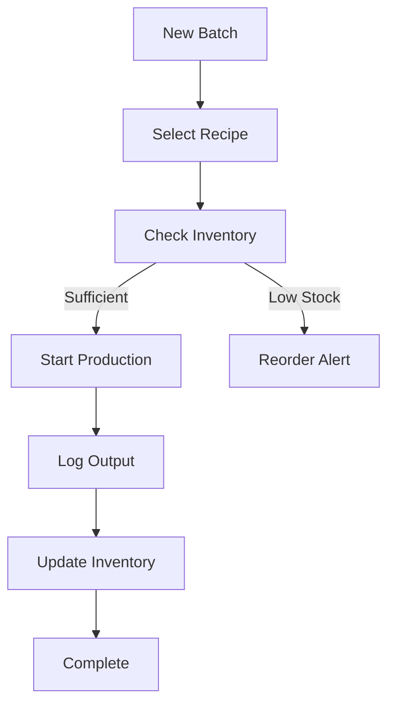

## Overview

Caska provides powerful tools designed specifically for food manufacturers to streamline operations. You can track inventory in real-time, manage orders and customers efficiently, plan production batches accurately, and automate follow-ups while generating insightful reports. These features help eliminate chaos and scale your business confidently.

<Columns cols={3}>
  <Card title="Inventory Tracking" icon="package" href="/docs/inventory">
    Monitor stock levels, set reorder points, and avoid shortages with automated alerts.
  </Card>
  <Card title="Order Management" icon="shopping-cart" href="/docs/orders">
    Handle orders from placement to delivery, with full visibility into customer patterns.
  </Card>
  <Card title="Production Planning" icon="settings" href="/docs/production">
    Plan batches, track ingredients, and ensure compliance with recipe management.
  </Card>
  <Card title="Customer CRM" icon="users" href="/docs/customers">
    Maintain customer histories, contacts, and purchase insights in one place.
  </Card>
  <Card title="Automated Follow-ups" icon="zap" href="/docs/automation">
    Re-engage customers automatically to boost repeat business.
  </Card>
  <Card title="Reports & Margins" icon="bar-chart-3" href="/docs/reports">
    Analyze profits, margins, and performance with customizable dashboards.
  </Card>
</Columns>

<Callout kind="info">
  Access all features from the main dashboard at `https://app.caska.app`. Start by connecting your inventory data for immediate insights.
</Callout>

## Inventory Tracking and Reordering

Set up inventory tracking to always know your stock levels. Caska monitors ingredients and finished goods, alerting you when items fall below reorder thresholds.

<Steps>
  <Step title="Add Items" icon="plus">
    Navigate to Inventory > Items and enter product details like name, unit, and supplier.

    ```
    Example item entry:
    - Flour: 50kg bags, reorder at 10 bags
    - Yeast: 1kg packs, reorder at 5 packs
    ```
  </Step>
  <Step title="Set Reorder Points" icon="settings">
    Configure minimum levels and lead times for each item.
  </Step>
  <Step title="Enable Alerts" icon="bell">
    Turn on email/SMS notifications for low stock.
  </Step>
</Steps>

## Order and Customer Management

Manage orders and customers seamlessly. Track every order stage and build detailed customer profiles.

<Tabs>
  <Tab title="Orders" icon="shopping-cart">
    View outstanding orders, history, and patterns.

    | Status     | Count | Actions          |
    |------------|-------|------------------|
    | Pending    | 12    | Approve/Ship     |
    | Shipped    | 45    | Track/Update     |
    | Delivered  | 78    | Invoice/Archive  |
  </Tab>
  <Tab title="Customers" icon="users">
    Access CRM data including contacts and notes.

    <Expandable title="View Customer History" default-open="true">
      Search by name or ID to see purchase patterns, locations, and interaction notes.
    </Expandable>
  </Tab>
</Tabs>

## Production Batch Planning

Plan production runs with precision. Define recipes, allocate ingredients, and track outputs.



<CodeGroup tabs="JSON,CSV">
  ```json
  {
    "batchId": "BATCH-001",
    "recipe": "Chocolate Chip Cookies",
    "ingredients": [
      {"item": "Flour", "qty": "20kg"},
      {"item": "Sugar", "qty": "10kg"}
    ],
    "yield": "500 units"
  }
  ```
  ```csv
  batchId,recipe,ingredients,qty,yield
  BATCH-001,Chocolate Chip Cookies,Flour,20kg,500 units
  ```
</CodeGroup>

## Automated Follow-ups and Reports

Automate customer re-engagement and generate reports on margins and performance.

<Callout kind="tip">
  Schedule follow-ups based on purchase history to increase repeat orders by up to 30%.
</Callout>

Use these report types:

| Report Type    | Purpose                          | Frequency |
|----------------|----------------------------------|-----------|
| Profit Margins | Analyze costs vs. revenue        | Weekly    |
| Inventory Turnover | Track stock efficiency         | Monthly   |
| Customer Trends| Identify top buyers and patterns | Quarterly |

<Expandable title="Advanced Reporting Configuration">
  Customize dashboards with filters for products, dates, and locations.

  ```
  Example filter:
  date: {start: "2024-01-01", end: "2024-12-31"}
  products: ["Cookies", "Bread"]
  ```
</Expandable>

Next, explore [Quickstart](/quickstart) to implement these features.